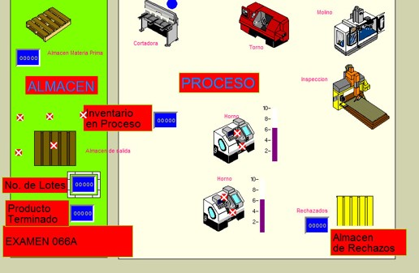

<h1 align="center">Hola 👋, soy Emma Yesenia Rivera Ruiz tu profesora</h1>
<h3 align="center">Bienvenido a la materia de Simulación</h3>

  

  

- 🌱  **Competencias de la asignatura** Analiza sistemas e identifica problemas mediante el enfoque de la simulación con el fin de proponer una solución al problema o una reconfiguración del sistema que lo mejore significativamente.

- 💬  **TEMARIO**

- ⚡  Tema 1 **INTRODUCCIÓN** 
- ⚡  Tema 2 **SIMULACIÓN DE VARIABLES ALEATORIAS ** 
- ⚡  Tema 3 **CONSTRUCCIÓN DE MODELOS DE SIMULACIÓN** 
- ⚡  Tema 4 **DISEÑO DE LA CALIDAD DE LA SIMULACIÓN ** 
- ⚡  Tema 5 **SIMULACIÓN EN HOJA DE CÁLCULO ** 
- ⚡  Tema 6 **CONSTRUCCIÓN DE MODELOS DE SIMULACIÓN** 

  

<h3 align="left">Algunos ejemplos:</h3>
<A HREF="https://www.youtube.com/watch?v=bjBUNkYiOfs"> PRACTICA 1 EN PROMODEL </A>

  

